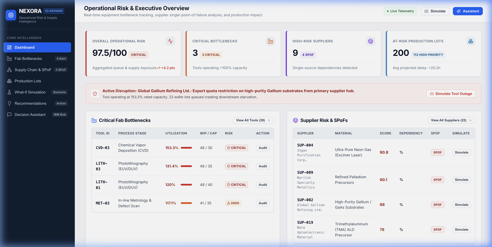
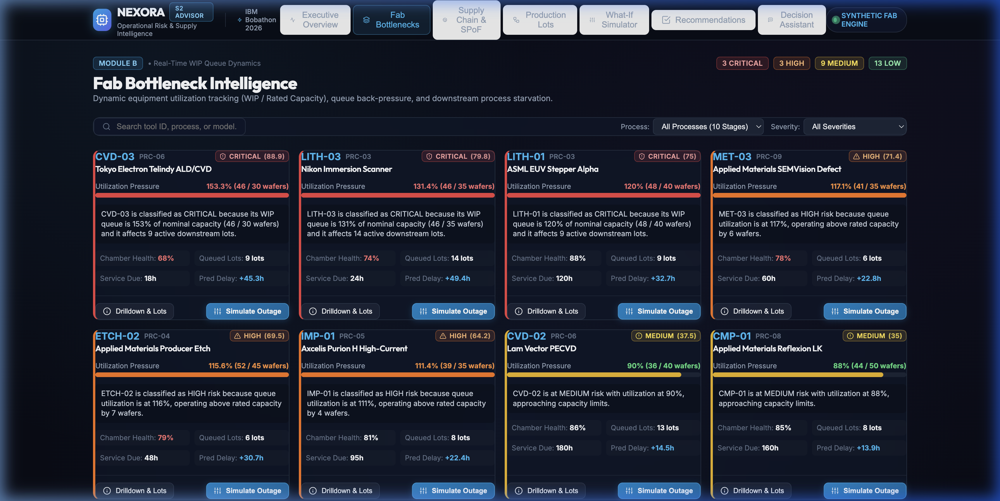
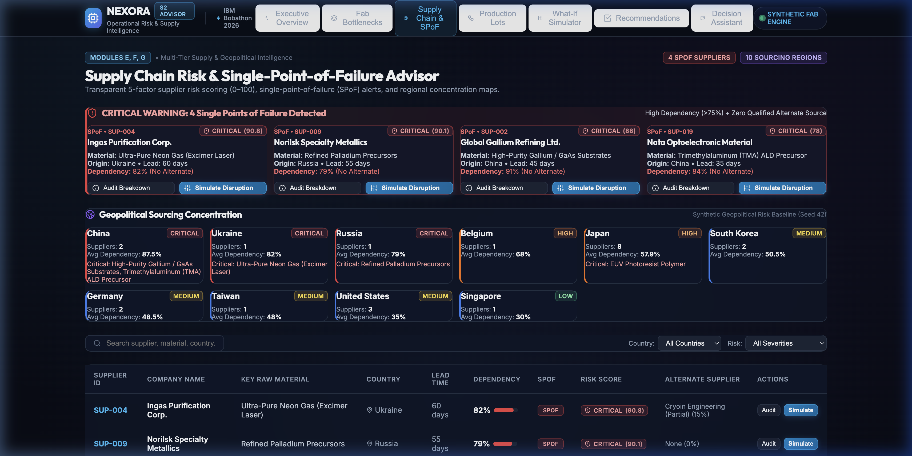
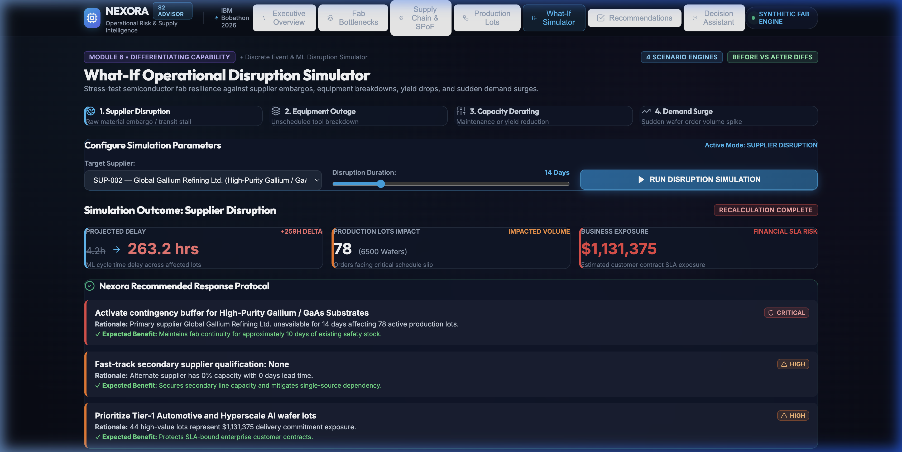
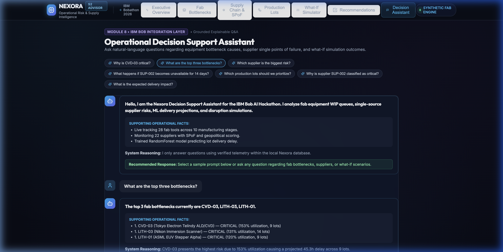
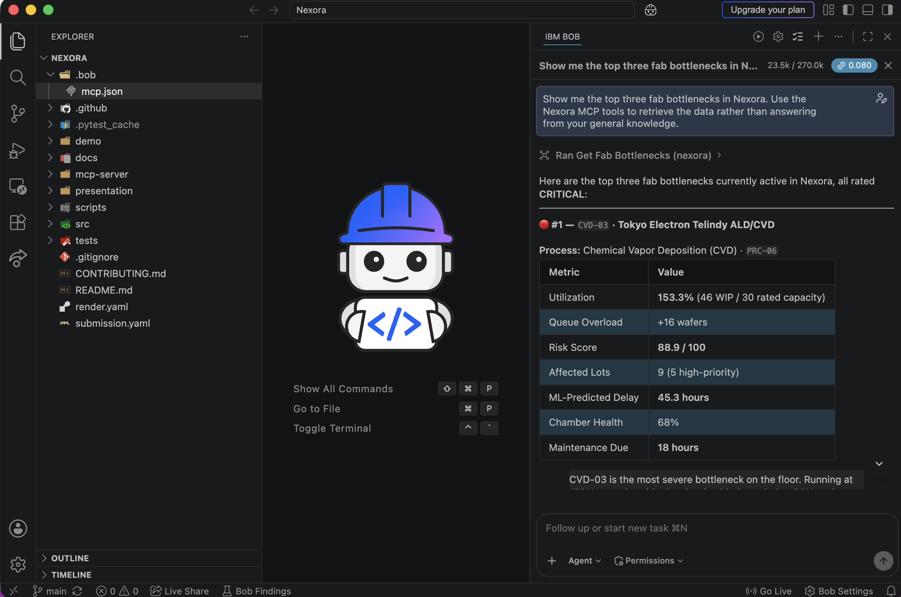
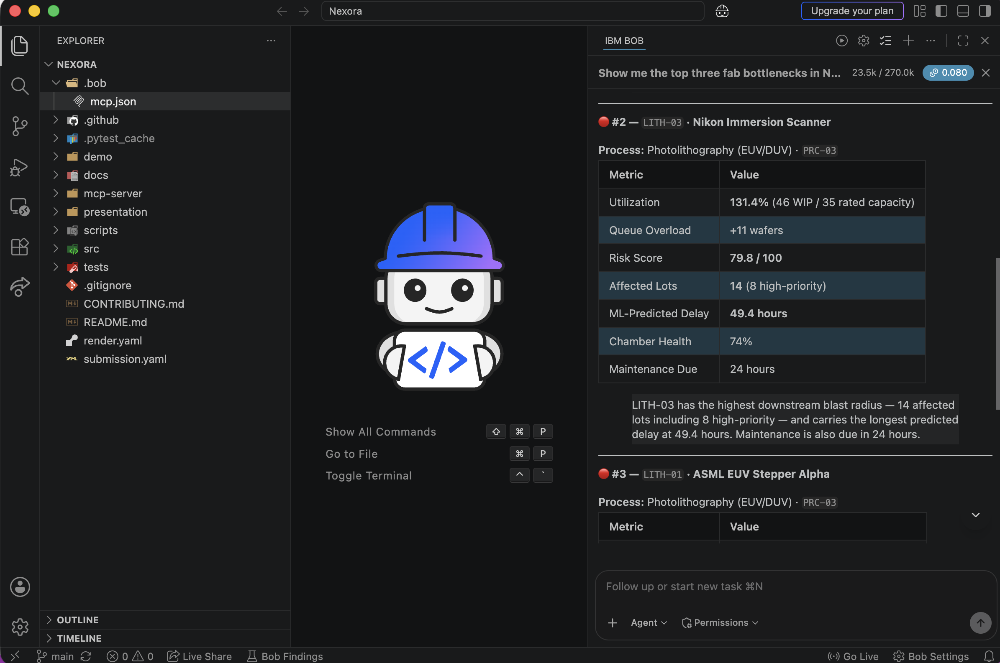
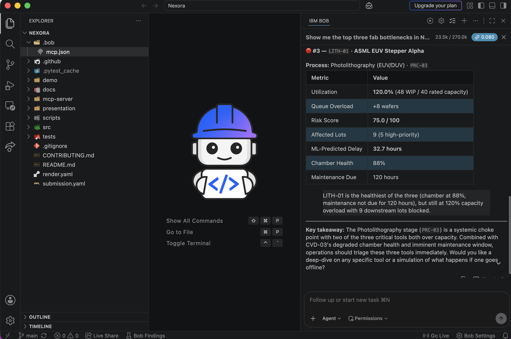

# 🚀 Nexora — Operational Risk & Supply Intelligence Platform

> **IBM Bob AI Innovation Hackathon 2026**  
> **Track:** AI  
> **Problem Statement S2:** Fab Bottleneck & Supply Chain Risk Advisor  

---

## 👥 Team & Submission Metadata

| Field | Details |
|---|---|
| **Project Title** | **Nexora — Operational Risk & Supply Intelligence Platform** |
| **Team Name** | **Stack_Trace** |
| **Track** | **AI** |
| **Problem Statement** | **S2 — Fab Bottleneck & Supply Chain Risk Advisor** |
| **Repository** | [https://github.com/neel92654/bob-ai-hackathon-Stack_Trace](https://github.com/neel92654/bob-ai-hackathon-Stack_Trace) |
| **Team Lead** | Neel Patel — `neelpatel.dev@outlook.com` |

---

## 🎬 Live Demonstration & Video Walkthrough

| Resource | Access Link | Description |
|---|---|---|
| 🌐 **Live Demo Platform** | **[https://nexora-7cs9.onrender.com](https://nexora-7cs9.onrender.com)** | Hosted full-stack interactive demonstration on Render |
| 📹 **Demo Video Walkthrough** | **[Google Drive Video Link](https://drive.google.com/file/d/14rTMIU_3UPpeAfhR0KWGfQKqcFggPFWK/view?usp=drive_link)** | 3–5 min comprehensive walkthrough of features & IBM Bob MCP integration |

---

## 🎯 Problem Statement

Semiconductor fabrication facilities operate tightly coupled, capital-intensive manufacturing lines where wafer cycle times span 26 to 52 weeks. Work-in-Progress (WIP) queue bottlenecks at critical equipment stages (Photolithography, Dry Etch, CVD) cause cascading delays across the fab. Simultaneously, extreme reliance on single-source chemical and material suppliers (such as Gallium, Neon gas, and EUV photoresist) exposes operations to catastrophic supply shocks. When equipment breaks down or export restrictions hit, operations and procurement teams lack unified, explainable tools to forecast downstream delivery impacts and simulate mitigation protocols before committing actions.

---

## 💡 The Nexora Solution

**Nexora** is an explainable operational risk and supply chain intelligence platform designed for semiconductor operations managers, fab line dispatchers, and procurement leaders. Nexora combines:
1. **Fab Bottleneck Intelligence:** Real-time queue-to-capacity tracking across 10 sequential semiconductor fabrication stages.
2. **Explainable 5-Factor Supplier Risk Scoring:** Multi-factor supplier evaluations with automated Single-Point-of-Failure (SPoF) detection.
3. **Machine Learning Delivery Delay Forecasting:** Interpretable `RandomForestRegressor` ($R^2 = 0.954$, $\text{MAE} = 2.81\text{h}$) predicting downstream customer order delays.
4. **Interactive What-If Disruption Simulator:** Multi-scenario stress-testing engine generating side-by-side Before vs. After metric diffs, financial SLA exposure, and scenario-specific mitigation recommendations.
5. **IBM Bob AI Agent Integration:** Native Model Context Protocol (MCP) server exposing 8 operational intelligence tools for natural-language decision support.

---

## ✨ Key Features

- **Fab Bottleneck Intelligence:** Computes equipment utilization ($\text{Utilization} = \text{WIP} / \text{Capacity} \times 100$), queue pressure metrics, and 10-stage sequential flow starvation mapping.
- **Explainable 5-Factor Supplier Risk Scoring:** Transparent 0–100 scoring based on Market Dependency (30%), Lead Time (25%), Material Criticality (20%), Geopolitical Risk (15%), and Alternate Availability (10%).
- **Automated SPoF Detection:** Instantly flags suppliers with $\ge 75\%$ dependency and no viable secondary source (e.g., Gallium, Neon Gas).
- **ML Delivery Delay Forecasting:** Trained RandomForestRegressor model predicting lot-level cycle delays with feature importance attribution and physics fallback.
- **Interactive 4-Scenario What-If Disruption Simulator:**
  1. *Supplier Disruption:* Evaluates multi-day raw material embargoes and inventory stockout horizons.
  2. *Equipment Failure:* Evaluates unscheduled machine breakdowns, WIP queue backpressure, and alternate tool rerouting.
  3. *Capacity Reduction:* Evaluates chamber derating, shift adjustments, and maintenance load balancing.
  4. *Demand Surge:* Evaluates incoming wafer volume spikes and fleet-wide bottleneck formations.
- **Scenario-Specific Mitigation Recommendations:** Dynamically synthesizes primary mitigation protocols and supporting action directives grounded directly in calculated simulation results.
- **Grounded Decision Assistant:** Natural-language console providing explainable operational answers backed strictly by verified platform data.
- **IBM Bob MCP Server:** 8 registered MCP tools enabling IBM Bob to query live platform analytics and run simulations via STDIO transport.

---

## 🤖 IBM Bob Integration (Model Context Protocol)

Nexora connects to **IBM Bob** through the **Model Context Protocol (MCP)** standard.

```
┌────────────────────────────────────────────────────────┐
│               IBM Bob (MCP Client / AI Agent)          │
└───────────────────────────┬────────────────────────────┘
                            │ (JSON-RPC via STDIO Transport)
                            ▼
┌────────────────────────────────────────────────────────┐
│        Nexora MCP Server (mcp-server/server.py)        │
│         Exposes 8 Structured Operational Tools         │
└───────────────────────────┬────────────────────────────┘
                            │ (Direct Service Invocations)
                            ▼
┌────────────────────────────────────────────────────────┐
│            Nexora Analytics & ML Engines               │
│  • Bottleneck Analyzer      • 5-Factor Supplier Engine │
│  • RandomForest ML Model   • What-If Simulation Engine │
└───────────────────────────┬────────────────────────────┘
                            │
                            ▼
┌────────────────────────────────────────────────────────┐
│     SQLite Database (nexora.db) & ML Artifacts         │
└────────────────────────────────────────────────────────┘
```

### Registered MCP Tools for IBM Bob
| Tool Name | Purpose |
|---|---|
| `get_fab_bottlenecks` | Retrieves fab equipment queue overloads, utilization %, and severity ratings. |
| `get_bottleneck_details` | Deep-dive root-cause diagnostics, chamber health, and queued lots for a specific tool ID (`CVD-03`). |
| `get_supplier_risk` | 5-factor supplier risk ranking (0–100), SPoF alerts, and geopolitical exposures. |
| `get_supplier_details` | Detailed risk breakdown and alternate sourcing coverage for a supplier ID (`SUP-002`). |
| `get_production_impact` | Active wafer lot tracking across manufacturing stages with ML delivery delay forecasts. |
| `run_disruption_simulation` | Executes What-If disruption simulations with Before vs. After diffs and financial SLA exposure. |
| `get_recommendations` | Prioritized, condition-driven mitigation action plans with operational rationales. |
| `get_executive_summary` | High-level executive operational summary of overall fab risk, alerts, and top priorities. |

---

## 🧠 Machine Learning & Explainability

- **Model Architecture:** `RandomForestRegressor` (`n_estimators=100`, `max_depth=12`, `random_state=42`)
- **Evaluation Metrics (Synthetic Demonstration Dataset):**
  - **$R^2$ Score:** `0.9544`
  - **Mean Absolute Error (MAE):** `2.809` hours
  - **Root Mean Squared Error (RMSE):** `3.745` hours
- **Features Used:** `tool_nominal_capacity`, `wip_queue_size`, `tool_utilization_pct`, `downstream_queue_size`, `wafer_quantity`, `lot_priority_num`, `remaining_stages`, `nominal_cycle_time_hr`, `chamber_health`, `has_active_disruption`.
- **Explainability:** Feature importance breakdown with deterministic physics fallback calculation when offline.

---

## 📊 Dataset & Transparency Notice

> **Synthetic Demonstration Dataset Notice:**  
> Nexora currently uses a reproducible synthetic demonstration dataset designed around the operational structure of the S2 problem statement (generated deterministically with Seed 42). The public website and APIs run a live deployment of the platform, but the underlying operational data is synthetic demonstration data rather than confidential semiconductor fab telemetry.

---

## 🛠️ Tech Stack

| Component | Technologies |
|---|---|
| **Frontend UI** | React 18, Vite, Lucide Icons, Vanilla Modern CSS Design System |
| **Backend REST API** | Python 3.11, Flask, Flask-CORS, Gunicorn |
| **Machine Learning** | scikit-learn, Pandas, NumPy, Joblib |
| **MCP / Agent Layer** | Model Context Protocol (MCP Python SDK), `.bob/mcp.json` |
| **Database** | SQLite (`nexora.db`) |
| **Testing & CI** | Pytest (53 automated tests), GitHub Actions CI |
| **Deployment** | Render (Static Site + Python Web Service with `render.yaml`) |

---

## 📁 Repository Structure

```
├── .bob/                      # IBM Bob MCP client configuration
│   └── mcp.json               # STDIO transport configuration for IBM Bob
├── mcp-server/                # Model Context Protocol (MCP) Server for IBM Bob
│   ├── server.py              # 8 MCP tools adapter connecting to Nexora services
│   ├── requirements.txt       # MCP server dependencies
│   └── README.md              # MCP server documentation
├── src/
│   ├── backend/               # Flask REST API, calculations, routes, services & ML
│   │   ├── app.py             # Flask application gateway & WSGI entry point
│   │   ├── config/            # Configurable risk thresholds & weights
│   │   ├── models/            # SQLite connection and schema
│   │   ├── routes/            # REST API blueprints (7 endpoints)
│   │   ├── services/          # Core analytics & simulation engines
│   │   ├── ml/                # RandomForestRegressor pipeline & inference
│   │   └── utils/             # Calculation & validation functions
│   ├── frontend/              # React 18 + Vite industrial dashboard UI
│   │   ├── src/components/    # Modular UI components (Navbar, Flow, Badges, Modals)
│   │   ├── src/pages/         # 7 core views (Dashboard, Bottlenecks, Supply, Simulator...)
│   │   └── src/services/      # Centralized REST API client
│   ├── data/                  # Synthetic CSV datasets (equipment, lots, suppliers...)
│   ├── .env.example           # Environment variable template
│   └── README.md              # Source code directory overview
├── docs/                      # Comprehensive documentation
│   ├── problem-statement.md   # Domain context & pain points
│   ├── solution-overview.md   # Architecture, workflows & design choices
│   ├── architecture.md        # Technical architecture with Mermaid diagrams
│   ├── setup-guide.md         # Step-by-step reproduction instructions
│   └── template-guide.md      # Template guide
├── demo/                      # Demonstration artifacts
│   ├── screenshots/           # Application & IBM Bob MCP integration screenshots
│   ├── demo-video-link.txt    # Video walkthrough link
│   └── live-demo-url.txt      # Hosted live demo URL
├── presentation/              # Slide deck documentation
│   ├── README.md
│   └── slides.md
├── scripts/                   # Reproducible generator & database initializers
│   ├── generate_data.py       # Deterministic synthetic data generator (Seed: 42)
│   └── init_db.py             # SQLite ingestion script
├── tests/                     # 53 automated backend & MCP tests
├── render.yaml                # Render Blueprint deployment configuration
├── submission.yaml            # Structured submission metadata
├── CONTRIBUTING.md            # Submission instructions
└── README.md                  # Main project entry point
```

---

## ⚡ Local Setup & Reproduction Instructions

### 1. Prerequisites
- Python 3.11+
- Node.js 18+ and npm 9+

### 2. Backend & Data Initialization
```bash
# Clone repository
git clone https://github.com/neel92654/bob-ai-hackathon-Stack_Trace.git
cd bob-ai-hackathon-Stack_Trace

# Install backend dependencies
pip install -r src/backend/requirements.txt
pip install -r mcp-server/requirements.txt

# Generate synthetic dataset (Seed: 42) & initialize database
python3 scripts/generate_data.py
python3 scripts/init_db.py

# Train the ML Delivery Prediction model
python3 src/backend/ml/train_delivery_model.py

# Run full test suite (53 tests)
pytest tests/ -v

# Start Flask backend API (Port 5001)
python3 src/backend/app.py
```

### 3. Frontend Application
```bash
# In a separate terminal:
cd src/frontend
npm install
npm run dev
```
Open your browser at `http://localhost:5173`.

### 4. Running the MCP Server for IBM Bob
```bash
python3 mcp-server/server.py
```
IBM Bob will automatically connect using `.bob/mcp.json`.

---

## 🖼️ Application Screenshots

| View | Screenshot |
|---|---|
| **Executive Dashboard** |  |
| **Fab Bottleneck Intelligence** |  |
| **Supply Chain & SPoF Advisor** |  |
| **What-If Disruption Simulator** |  |
| **Operational Decision Assistant** |  |
| **IBM Bob MCP Agent Integration** |  |
| **IBM Bob Bottleneck & SPoF Analysis** |  |
| **IBM Bob What-If Disruption Simulation** |  |
