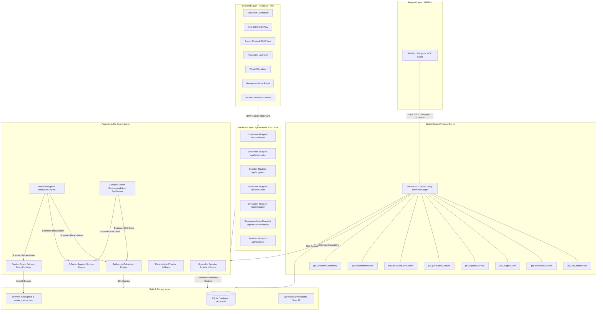
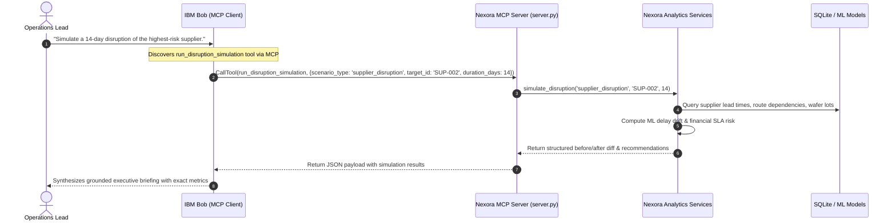
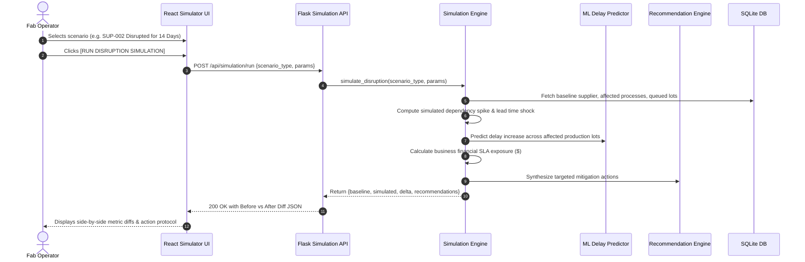

# Architecture: Nexora Platform

## System Architecture

---

## IBM Bob + MCP Integration Architecture

Nexora exposes its operational intelligence capabilities through a standards-compliant **Model Context Protocol (MCP)** server over local **STDIO transport**.

---

## What-If Disruption Simulation Data Flow

---

## Components Breakdown

| Component | Technology | Responsibility |
|---|---|---|
| **IBM Bob Client** | IBM Bob Agent | Discovers and invokes MCP tools locally to answer operational queries and simulate scenarios. |
| **Nexora MCP Server** | Python `mcp` SDK, STDIO | Implements 8 native MCP tools exposing bottleneck, supplier, delivery, and simulation intelligence. |
| **Frontend UI** | React 18, Vite, Lucide Icons | Responsive industrial operations console, interactive process flow visualizer, drilldown modals, and simulation dashboards. |
| **API Gateway** | Flask 3.0, Flask-CORS | REST routing, JSON payload validation, error formatting, and CORS management on port 5001. |
| **Bottleneck Engine** | Python (`calculations.py`, `bottleneck_service.py`) | Computes tool utilization percentage, queue pressure, risk tiering (`LOW`, `MEDIUM`, `HIGH`, `CRITICAL`), and downstream stage starvation paths. |
| **Supplier Risk Engine** | Python (`supplier_risk_service.py`) | 5-factor weighted risk scoring (0–100), automated Single-Point-of-Failure (SPoF) detection, and country concentration metrics. |
| **Delivery ML Pipeline** | scikit-learn (`RandomForestRegressor`), Pandas, NumPy | Trains on historical fab delay logs ($R^2 = 0.954$, MAE = 2.81h), generates predictions with feature importance attribution, and provides deterministic physics fallback. |
| **Simulation Engine** | Python (`simulation_service.py`) | Dispatches and calculates outcomes for 4 disruption scenarios (Supplier Disruption, Tool Outage, Capacity Loss, Demand Surge) with Before vs. After diffs. |
| **Recommendation Engine** | Python (`recommendation_service.py`) | Evaluates active system conditions and synthesizes prioritized, explainable operational response protocols. |
| **Decision Assistant** | Python (`assistant_service.py`) | Grounded natural-language query parser answering questions strictly using verified database facts with supporting reasoning. |
| **Database** | SQLite (`nexora.db`) | Local ACID-compliant database storing equipment, lots, suppliers, process routes, disruptions, and historical delays. |

---

## Data Flow & Processing Lifecycle

1. **Ingestion & In-Memory Hydration:** On initialization or request, SQL queries extract active equipment statuses, lot positions, and supplier dependency shares.
2. **Dynamic Metric Calculation:** Pure functions in `src/backend/utils/calculations.py` compute utilization, queue pressure, and weighted risk scores without modifying the persistent store.
3. **ML Feature Assembly:** For each lot, operational attributes (nominal capacity, WIP queue size, priority number, remaining process stages, chamber health) are transformed into a feature DataFrame and evaluated by `RandomForestRegressor`.
4. **Prescriptive Synthesis:** The recommendation engine checks active bottleneck tiers and SPoF flags, generating prioritized mitigations with operational rationales.
5. **Dual Interface Consumption:**
   - **Visual Dashboard:** The React frontend displays interactive flows, KPI cards, Before/After simulation diffs, and filterable tables.
   - **Agent Interface (IBM Bob):** IBM Bob invokes native MCP tools over STDIO, receiving structured JSON to reason over live operations.

---

## Security & Reliability Considerations

- **Zero Hard-Coded Credentials:** All configuration is managed via `.env.example` and environment variables; `.env` is ignored in Git.
- **Local STDIO Transport:** The MCP server communicates via process pipes without exposing open network ports or requiring remote authentication.
- **Strict Input Validation:** All API endpoints and MCP tool handlers validate incoming parameters and return structured HTTP status codes / error strings without crashing.
- **Offline-First Resilience:** The core application runs locally with zero external API dependencies, guaranteeing complete reproducibility for evaluation.

